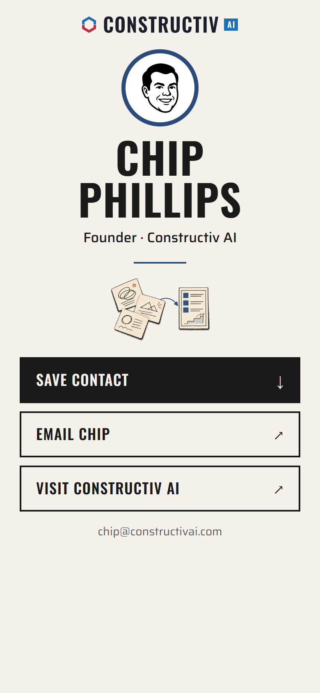
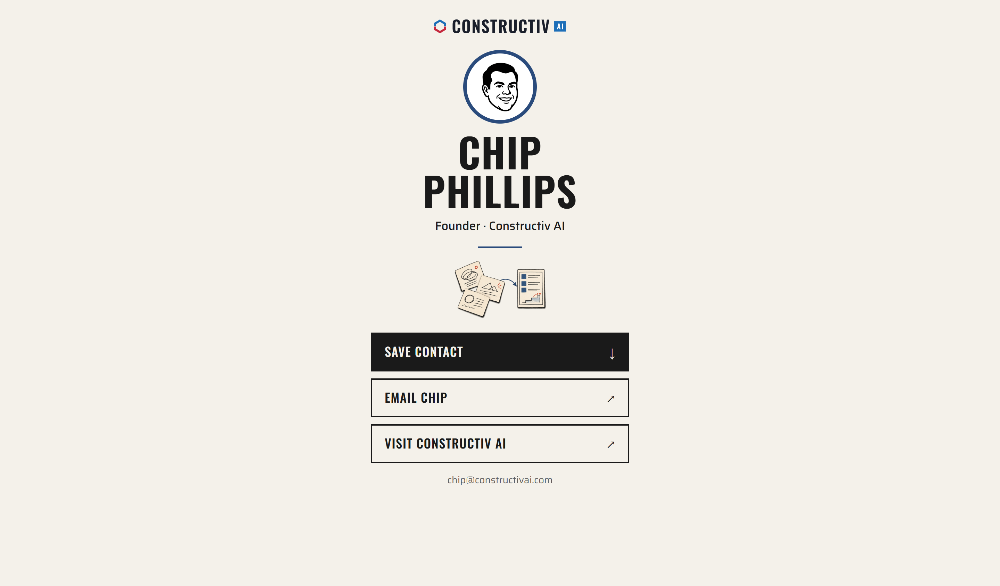

# Chip Phillips contact page

Static HTML/CSS and a downloadable vCard. No JavaScript, backend, forms, analytics or account required.

## Local preview

Run `python3 -m http.server 8080 --directory docs` and open http://localhost:8080/. Check at 320px, 390px and desktop widths. Save Contact downloads `public/Chip-Phillips.vcf`; Email opens a mail composer; Website opens Constructiv AI.

## Publishing

GitHub Pages serves `/docs` from `feat/contact-page`. A review PR to `main` stays unmerged. Only pushes to that designated source branch publish; PR creation and pushes to main do not deploy this page. There are no custom Actions workflows. The page uses relative asset and vCard paths to support its repository subpath.

## Public content

Name, title, organization, email and website are the verified public contact subset. No original contact export, private source data or email artifacts are included. LinkedIn is omitted until supplied. Font licenses are in docs/assets.

## Review images

